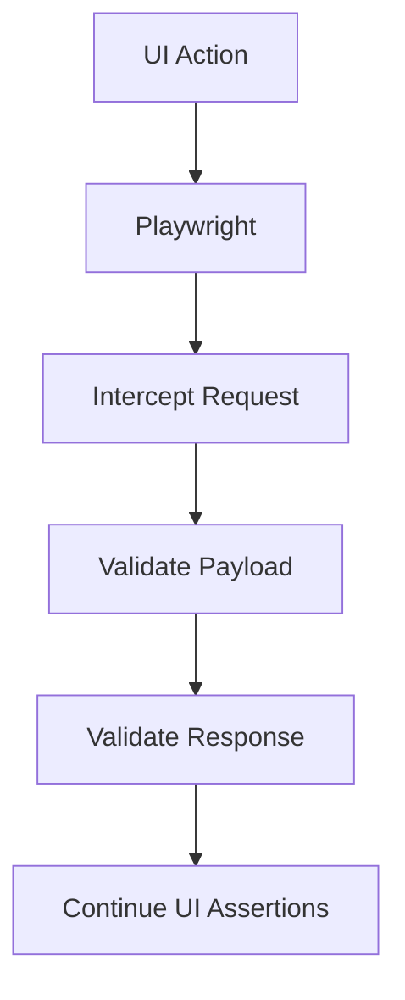

# commerce-qa-platform — Testing Workspace

Overview
 - This workspace contains Playwright UI and API tests for the demo site.

Quick start

1. Install dependencies

```bash
npm ci
```

2. Create an env file based on `.env.example` and set credentials for `auth:record` if needed.

3. Record authentication state (optional)

```bash
export TEST_USERNAME=your_user
export TEST_PASSWORD=your_pass
npm run auth:record
```

4. Run smoke tests

```bash
npm run test:smoke
```

Scripts

- `npm run test` — run all tests
- `npm run test:smoke` — run smoke across desktop browsers
- `npm run test:regression` — run regression across desktop browsers
- `npm run test:mobile` — run mobile-tagged tests on mobile emulation projects
- `npm run auth:record` — create `tests/state/auth.json` by logging in once
- `npm run show-report` — open the last Playwright HTML report

CI

Workflows are in `.github/workflows/` for smoke, regression and api jobs.

Tagging helper
---------------

Run the tagging script to insert textual test tags into test titles (edits files in-place):

```bash
node tools/add-test-tags.js
```

GitHub Actions
--------------

A CI workflow is provided at `.github/workflows/playwright-ci.yml` which:

- runs `tests/api` and `tests/ui` as parallel matrix targets
- installs Playwright browsers and dependencies
- uploads `playwright-report/` and `test-results/` directories as artifacts

Backend Verification Layer
-------------------------

This repository implements a layered Backend Verification approach to keep API, network, and UI checks separated and reusable.

- **Service Layer:** reusable API clients and helpers used by tests. See [services/ProductService.js](services/ProductService.js), [services/AuthService.js](services/AuthService.js), and [services/CartService.js](services/CartService.js).
- **API Layer:** direct endpoint tests that call services without UI. See [tests/api](tests/api/products/products.spec.js) for examples.
- **Network Layer:** UI-triggered request interception and validation. See [tests/network/assertions.js](tests/network/assertions.js) and the network specs in [tests/network](tests/network/products-network.spec.js).

Key practices
- Request interception: use `page.waitForResponse()` or `page.waitForRequest()` to capture requests triggered by UI actions, then validate both `request()` and `response()` objects.
- Payload validation: assert HTTP method, endpoint (contains), required request fields, and content-type. We centralize this in [tests/network/assertions.js](tests/network/assertions.js).
- Response validation: assert status codes and response body shape; use a small `responseValidator` callback for custom checks.
- Cross-browser execution: keep synchronization in Page Objects (see [pages/HomePage.js](pages/HomePage.js) and [pages/ProductPage.js](pages/ProductPage.js)); use `playwright.config.js` projects for Chromium, Firefox, WebKit, Mobile Chrome and Mobile Safari.

Architecture



Where to look
- Service implementations: [services/](services)
- API tests: [tests/api/](tests/api)
- Network interception tests: [tests/network/](tests/network)
- Shared network assertions: [tests/network/assertions.js](tests/network/assertions.js)
- Page Objects (synchronization helpers): [pages/HomePage.js](pages/HomePage.js), [pages/ProductPage.js](pages/ProductPage.js)
- Playwright config and projects: [playwright.config.js](playwright.config.js)

Recommended workflow
1. Use the **Service Layer** for direct API verification and test data setup.
2. Use the **Network Layer** to validate UI-triggered HTTP requests (payloads, headers, and responses).
3. Keep UI assertions independent and rely on the Network Layer for backend contract checks.

If you want, I can add a short CONTRIBUTING section with guidelines and a checklist for adding new API/network tests.

