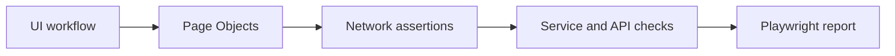

# Commerce QA Platform

An end-to-end quality engineering workspace for a commerce application, built with Playwright. The project demonstrates layered test design across UI workflows, API contracts, browser network traffic, accessibility, mobile emulation, and CI reporting.

## What This Demonstrates

- Page Object Model with reusable navigation and synchronization helpers
- Direct API verification through reusable service clients
- Network interception for request payload, header, and response validation
- Cross-browser coverage across Chromium, Firefox, WebKit, Mobile Chrome, and Mobile Safari
- Functional coverage for authentication, registration, product discovery, cart, checkout, orders, and search
- Playwright HTML reports, failure screenshots, videos, traces, and CI artifacts
- Data-driven test setup with environment-based configuration and optional authentication state

## Test Architecture



The test layers have distinct responsibilities:

- **Page Objects:** encapsulate selectors, navigation, and UI synchronization. See [pages/](pages).
- **Service layer:** centralizes API calls and reusable test-data operations. See [services/](services).
- **API layer:** verifies endpoint behavior and response contracts without a browser. See [tests/api/](tests/api).
- **Network layer:** validates requests triggered by UI actions, including method, endpoint, headers, payload, and response shape. See [tests/network/assertions.js](tests/network/assertions.js).

## Coverage

The suite covers:

- Authentication and registration, including invalid input and boundary cases
- Product listing, categories, detail pages, pricing, and navigation
- Cart operations and persistence checks
- Checkout validation and purchase flows
- Order history and order-detail behavior where supported by the application
- API authentication, products, cart, orders, and purchase endpoints
- Accessibility and UI-triggered network behavior

## Getting Started

```bash
npm ci
npm run test:smoke
```

For authenticated scenarios, create an environment file from `.env.example`, set `TEST_USERNAME` and `TEST_PASSWORD`, then record the storage state:

```bash
npm run auth:record
```

## Test Commands

| Command | Purpose |
| --- | --- |
| `npm run test` | Run the complete Playwright suite |
| `npm run test:smoke` | Run smoke-tagged tests on desktop browsers |
| `npm run test:regression` | Run regression-tagged tests on desktop browsers |
| `npm run test:api` | Run API tests |
| `npm run test:mobile` | Run mobile-tagged tests on mobile projects |
| `npm run show-report` | Open the latest HTML report |

## Latest Test Result

**Run date:** 2026-08-24
**Command:** `npx playwright test`
**Result:** Failed, exit code `1`
**Scheduled:** 1,758 tests across four workers

The terminal output identified these failures before the run was stopped:

| Test | Result | Cause observed |
| --- | --- | --- |
| `AUTH-24 Register two users and login with both` | Failed | The login modal remained hidden while the test attempted to fill `#loginusername`. |
| `CART-17 Cart storage uses localStorage or cookies (smoke)` | Failed | The guarded browser evaluation returned `null`, causing the truthiness assertion to fail. |
| `CHECKOUT-01 Place order modal opens from cart` | Failed | The order modal remained hidden after the checkout action. |

### Passed Tests

The run continued executing other UI, API, network, accessibility, and mobile checks after these failures. Tests that completed without an assertion or runtime error were reported as passed by Playwright. The terminal output available for this run did not emit the final aggregate pass count before termination, so no unverified number is claimed here.

### Skipped Tests

Skipped tests are intentional and conditional:

- **Optional UI behavior:** skipped when the demo application does not expose a control, data set, order, or feature being checked, such as optional order actions or search suggestions.
- **Backend-dependent checks:** skipped when an endpoint does not return a usable response, product, cart item, order ID, or supported status for the current environment.
- **Authentication recording:** skipped unless `TEST_USERNAME` and `TEST_PASSWORD` are configured.
- **Phase 3 placeholders:** explicitly skipped with `not implemented` until their planned workflows are implemented against a stable backend contract.

This keeps unsupported environment behavior separate from genuine regressions while making the reason for every conditional skip visible in the test code.

## CI and Reporting

The GitHub Actions workflows in `.github/workflows/` run smoke, regression, and API jobs. CI installs the required Playwright browsers and uploads `playwright-report/` and `test-results/` as build artifacts for review.

## Repository Guide

- [Playwright configuration](playwright.config.js)
- [Test strategy](docs/test-strategy.md)
- [Test catalog](config/test-catalog.md)
- [Test tags](docs/test-tags.md)
- [Page Objects](pages/)
- [API and network tests](tests/)

